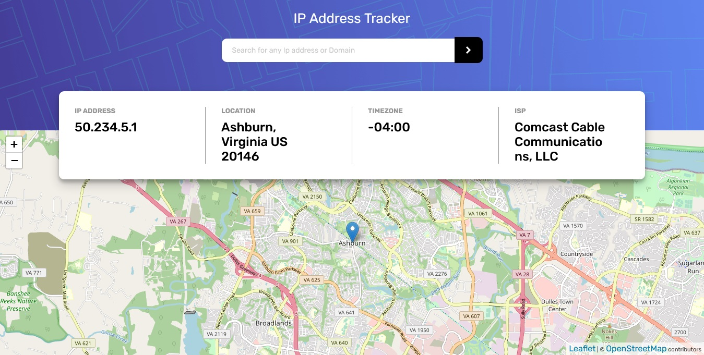

# Frontend Mentor - IP address tracker solution

This is a solution to the [IP address tracker challenge on Frontend Mentor](https://www.frontendmentor.io/challenges/ip-address-tracker-I8-0yYAH0). Frontend Mentor challenges help you improve your coding skills by building realistic projects. 

## Table of contents

  - [The challenge](#the-challenge)
  - [Screenshot](#screenshot)
  - [Links](#links)
  - [Built with](#built-with)
  - [Continued development](#continued-development)
  - [Useful resources](#useful-resources)
- [Author](#author)

### The challenge

Users should be able to:

- View the optimal layout for each page depending on their device's screen size
- See hover states for all interactive elements on the page
- See their own IP address on the map on the initial page load
- Search for any IP addresses and see the key information and location

### Screenshot

### Links

- Solution URL: 
- Live Site URL: 

### Built with

- HTML5 
- CSS
- Mobile-first workflow
- [React](https://reactjs.org/) - JS library
- Css Modules - For styles
- [ipgeolaction API](https://ipgeolocation.io)
- React Leaflet map (https://react-leaflet.js.org/)

### What I learned

- Learnt how to use React Redux 
- Learnt how Fetch API really works and how to use it
- Learnt how to use async functions

### Continued development

Adding of ip address validation feature.

**Note: Delete this note and the content within this section and replace with your own plans for continued development.**

### Useful resources

- Fetch API(https://developer.mozilla.org/en-US/docs/Web/API/Fetch_API) - For quick reference
- React Redux documentation(https://redux.js.org/introduction/installation) - For quick reference

## Author

- Name: Okose Chidelu Karl
- Frontend Mentor - [@Karl-Wilson](https://www.frontendmentor.io/profile/Karl-Wilson)
- Instagram - (https://www.insragram.com/@developerkarl
